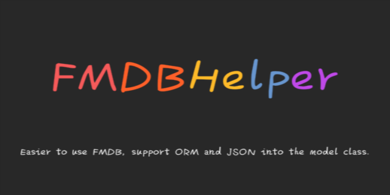

# FMDBHelper
[](https://travis-ci.org/lijingcheng/FMDBHelper)
[](http://cocoadocs.org/docsets/FMDBHelper)
[](http://cocoadocs.org/docsets/FMDBHelper)
[](http://cocoadocs.org/docsets/FMDBHelper)

 

## Installation

pod "FMDBHelper"

## Usage

- Add #import "FMDBHelper.h" to your prefix.pch
-  Setting up the database file and the file must be exist.
``` objc
[FMDBHelper setDataBaseName:@"demo.db"];
```

## Example  

if you have a table like this:
``` js
user (
  id text PRIMARY KEY,
  name text,
  age integer,
  birthday text,
  dept text
)
```
or have a JSON like this:
``` js
{
  "id": "a1b2c3d4e5",
  "username": "李京城",
  "age": 31,
  "birthday": "1984/3/28",
  "dept":{
    "id": "f6g7h8i9j0",
    "name": "dev",
    "manager": "X"
  }
}
```

Create a model class and declare properties, property name must be consistent with the field names in a database table, but it doesn't have to be consistent with json keys.

``` objc
//User.h
@interface User : NSObject

@property (nonatomic, copy) NSString *name;
@property (nonatomic, assign) NSInteger age;
@property (nonatomic, copy) NSString *birthday;
@property (nonatomic, strong) Dept *dept;

@end

//User.m
@implementation User

//if the property name and the JSON keys is not the same key, you need to overwrite this method.
- (NSDictionary *)mapping
{
    return @{@"username": @"name"};
}

//if the property type is a custom class, you need to overwrite this method.
- (NSDictionary *)objectPropertys
{
    return @{@"dept": [Dept class]};
}

//if the model class name and the table name is different, you need to overwrite this method
+ (NSString *)tableName
{
    return @"sys_user";
}

@end
```

Read JSON and insert it into the table. 

``` objc
NSString *path = [[NSBundle mainBundle] pathForResource:@"demo" ofType:@"json"];
NSDictionary *keyValues = [NSJSONSerialization JSONObjectWithData:[NSData dataWithContentsOfFile:path] options:NSJSONReadingMutableLeaves error:nil];

User *user = [[User alloc] initWithDictionary:keyValues];

[FMDBHelper insertObject:user];

```

Query data from the table and initialize the model object

``` objc
NSDictionary *result = [FMDBHelper queryById:@"a1b2c3d4e5" from:[User tableName]];

User *user = [[User alloc] initWithDictionary:result];

NSLog(@"%@, %@, %ld, %@", user.ID, user.name, (long)user.age, user.birthday);
NSLog(@"%@, %@, %@", user.dept.ID, user.dept.name, user.dept.manager);
```

**More usage reference test case.**

## Attention

Does not support model collections, such as NSArray&lt;User&gt;* users;

## Author

[李京城](http://lijingcheng.github.io)

## License

MIT

