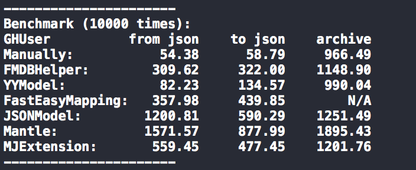

# FMDBHelper

[]((https://cocoapods.org/pods/FMDBHelper)
[](https://cocoapods.org/pods/FMDBHelper)
[](https://cocoapods.org/pods/FMDBHelper)
[](https://cocoapods.org/pods/FMDBHelper)

 

## Installation

FMDBHelper is available through [CocoaPods](https://cocoapods.org). To install
it, simply add the following line to your Podfile:

```ruby
pod 'FMDBHelper', '1.1.0'
```

## Performance

 

support for sqlite rw.

## Usage

- Add `#import "FMDBHelper.h"` to your prefix.pch
- And `[FMDBHelper setDataBaseName:@"demo.db"];`

## Example  

if you have a table like this:

```js
user (
id text PRIMARY KEY,
name text,
age integer,
birthday text,
dept text,
dogs text
)

```
or have a JSON like this:

```js
{
"id": "a1b2c3d4e5",
"username": "李京城",
"age": 32,
"birthday": "1984/3/28",
"dept":{
"id": "f6g7h8i9j0",
"name": "dev",
"manager": "X"
},
"dogs":[{
"id": "0x0x0x0x",
"name": "ahuang",
"age": "15"
}, {
"id": "1x1x1x1x",
"name": "xhei",
"age": "6"
}
],
"nums":[
123,
234
]
}
```

Create a model class and declare properties, property name must be consistent with the field names in a database table, but it doesn't have to be consistent with json keys.

``` objc
//User.h
@interface User : NSObject

@property (nonatomic, copy) NSString *name;
@property (nonatomic, assign) NSInteger age;
@property (nonatomic, copy) NSString *birthday;
@property (nonatomic, strong) Dept *dept;
@property (nonatomic, copy) NSArray<Dog *> *dogs;
@property (nonatomic, copy) NSArray<NSNumber *> *nums;

@end

//User.m
@implementation User

// if the property name and the JSON keys is not the same key, you need to overwrite this method.
- (NSDictionary *)mapping {
return @{ @"username": @"name" };
}

// if the property type is a custom class, you need to overwrite this method.
- (NSDictionary *)objectPropertys {
return @{ @"dept": [Dept class] };
}

// If the property type is a NSArray<...>, and property type is a custom class, you need to overwrite this method.
- (NSDictionary *)genericForArray {
return @{ @"dogs": [Dog class] };
}

// if the model class name and the table name is different, you need to overwrite this method
+ (NSString *)tableName {
return @"sys_user";
}

@end
```

Read JSON and insert it into the table. 

``` objc
NSString *path = [[NSBundle mainBundle] pathForResource:@"demo" ofType:@"json"];
NSDictionary *keyValues = [NSJSONSerialization JSONObjectWithData:[NSData dataWithContentsOfFile:path] options:NSJSONReadingMutableLeaves error:nil];

User *user = [[User alloc] initWithDictionary:keyValues];

[FMDBHelper insertObject:user];

```

Query data from the table and initialize the model object

``` objc
NSDictionary *result = [FMDBHelper queryById:@"a1b2c3d4e5" from:[User tableName]];

User *user = [[User alloc] initWithDictionary:result];

NSLog(@"%@, %@, %ld, %@", user.ID, user.name, (long)user.age, user.birthday);
NSLog(@"%@, %@, %@", user.dept.ID, user.dept.name, user.dept.manager);

NSArray<Dog *> *dogs = user.dogs;

[dogs enumerateObjectsUsingBlock:^(Dog * _Nonnull obj, NSUInteger idx, BOOL * _Nonnull stop) {
NSLog(@"%@,%@,%ld", obj.ID, obj.name, obj.age);
}];
```

**More usage reference test case.**

## Author

[李京城](http://lijingcheng.github.io)

## License

FMDBHelper is available under the MIT license. See the LICENSE file for more info.


